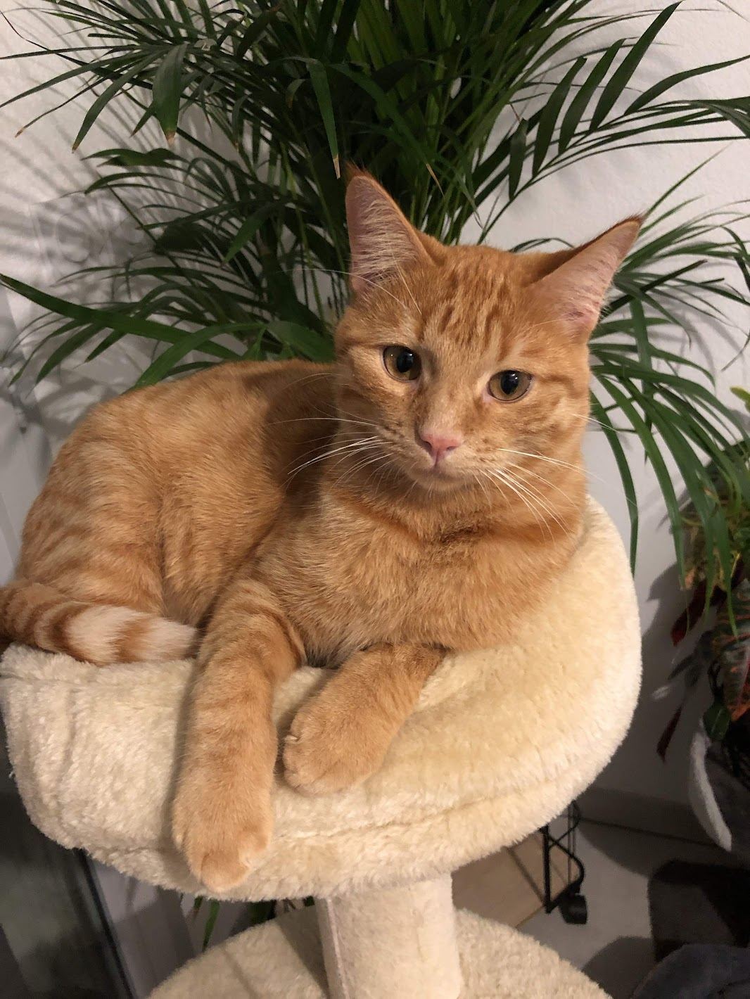
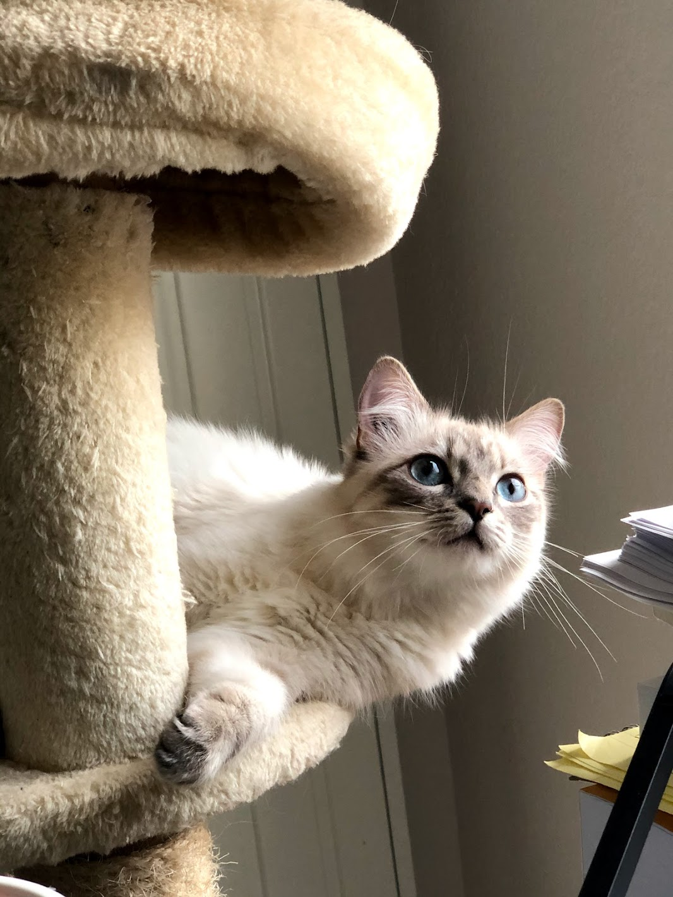

Hi there! I'm **Nawal OULD AMER**, an AI Scientist currently working as a Lead Research Scientist at [Airbus](https://www.airbus.com).

My research focuses on Natural Language Processing and building robust ML systems that work at scale in production environments. I'm particularly interested in the gap between academic NLP and the engineering discipline required to make it reliable in the real world.

## Interests

- Building NLP Systems for industrial applications
- ML Systems at Scale — architecture, reliability, monitoring
- Collaborative research on language technologies

## Get in touch

The best way to reach me is by email: [noa@nawalouldamer.com](mailto:noa@nawalouldamer.com)

---

## The important things in life

| Paladin | Yuki |
|:-------:|:----:|
|  |  |

Two cats. Very senior colleagues.
